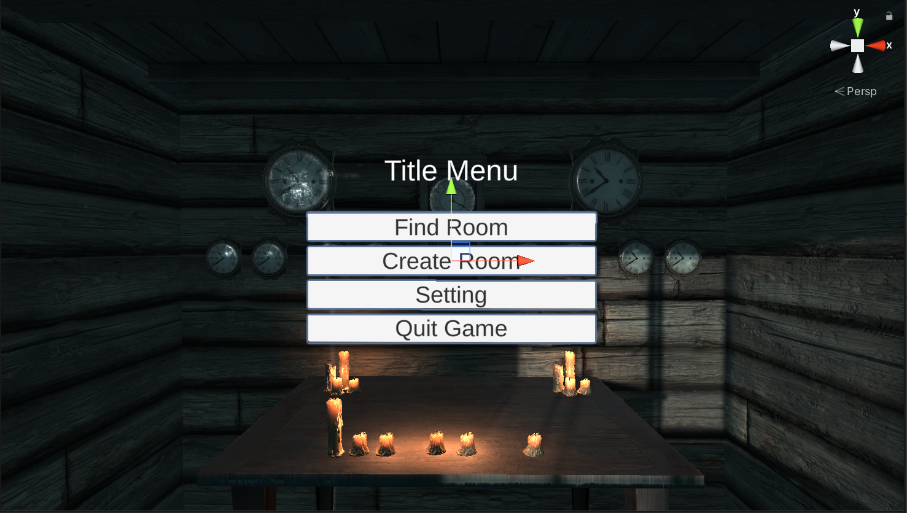
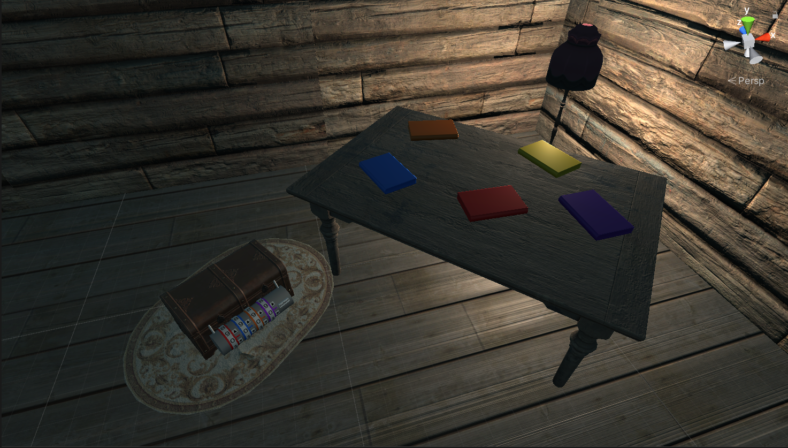
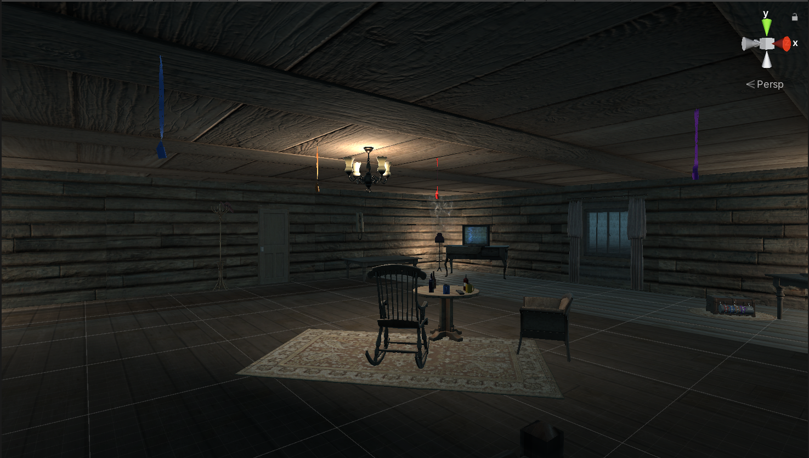
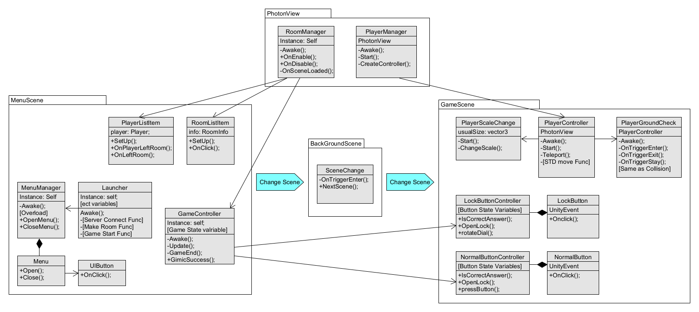

# [Escape H] : Unity Photon Project
Unity Engine의 Photon을 활용한 2일 로컬 서버 멀티플레이 게임

<br>

## 개발 기간: 2022.01. ~ 2022.06. (20주)

## 참여 인원: 4인
- 김우성(포톤 멀티플레이 개발)
- 손성한(에셋)
- 김민준(버튼 기믹 개발)
- 전현우(체스 기믹 개발)

## 기술 스택
- IDE: Unity 2019.4.37 lts
- OS: Windows 10, Meta Horizon OS
- HW: Meta Quest 2
- API
  - Photon
- Asset
  - Flooded Grounds
  - Vintage House
  - FXFIED
  - Horror Sound Pack
  - Polygonmarker

## 게임 이미지





## 시스템 구성도


## 주요 코드

- ### 게임 전체의 진척도 체크
```cs
/******************************************************************************
* GameController.cs
******************************************************************************/
public class GameController : MonoBehaviour
{
  public static GameController Instance; 

  // 기믹 완료 여부 변수
  public bool[] roomAGimic = {false, false, false}; // 책, 화로, 체스
  public bool[] roomBGimic = {false, false, false}; // 액자, 촛불, 체스

  private void Awake()
  {
    // 싱글턴 생성
    Instance = this;
  }

  private void Update()
  {
    // 어느 한쪽이 기믹 모두 완료하면 게임 종료
    if ((roomAGimic[0] == true && roomAGimic[1] == true && roomAGimic[2] == true)
        || (roomBGimic[0] == true && roomBGimic[1] == true && roomBGimic[2] == true))
      {
        GameEnd();
      }
  }

  private void GameEnd()
  {
    // 게임 종료 텍스트 출력
    GameeObject.Find("UICanvas").transform.Find("txtEnd").transform.gameObject.SetActive(true);
  }

  public void GimicSUccess(char room, int gimic)
  {
    // 기믹 완료시 호출되는 함수: public
    if (room == 'A')
    {
      roomAGimic[gimic] = true;
    }
    else if (room == 'B') {
      roomBGimic[gimic] = true;
    }
  }
}

```


- ### MenuScene의 이미지 표시 기능
```cs
/******************************************************************************
* MenuManager.cs
******************************************************************************/
public class MenuManager : MonoBehaviour
{
    public static MenuManager Instance; 

    [SerializeField] Menu[] menus; // 직렬화: Hierarchy에서 편집 가능


    private void Awake()
    {
        Instance = this;
    }

    // OpenMenu 오버로딩
    public void OpenMenu(string menuName)
    {
        for (int i = 0; i < menus.Length; i++)
        {
            if (menus[i].menuName == menuName) // string에 해당하는 메뉴를 연다.
            {
                menus[i].Open();
            }
            else if (menus[i].open) // 현재 열려있는 메뉴를 닫는다.
            {
                CloseMenu(menus[i]);
            }
        }
    }

    public void OpenMenu(Menu menu) // Menu에 해당하는 메뉴를 연다.
    {
        for (int i = 0; i < menus.Length; i++)
        {
            if (menus[i].open)
            {
                CloseMenu(menus[i]);
            }
        }
        menu.Open();
    }

    public void CloseMenu(Menu menu)
    {
        menu.Close();
    }
}

```


## 기타사항
